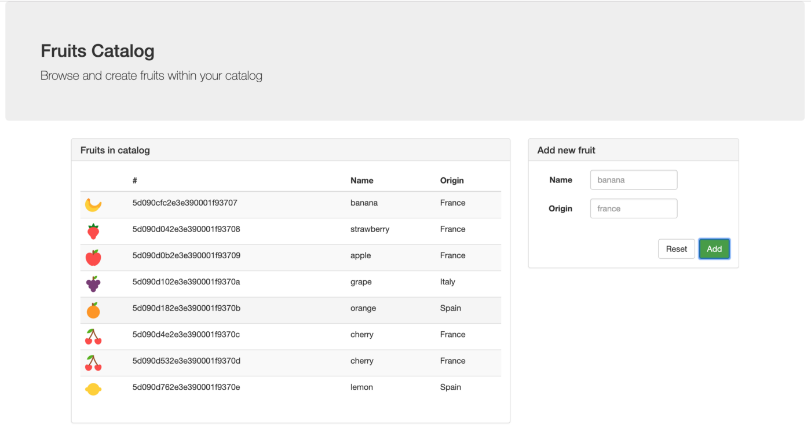

## fruits-catalog frontend

> IMPORTANT: This application requires NPM 6.9.0 or greater.

You'll need to run the following command to install any dependencies: 

```sh
$ npm install
[...]

added 1203 packages from 1296 contributors and audited 34104 packages in 218.161s
found 1957 vulnerabilities (1444 low, 7 moderate, 506 high)
  run `npm audit fix` to fix them, or `npm audit` for details
```

### Run, test and deploy

#### Running locally

To run this frontend on your local host:

```sh
$ npm run

> fruits-catalog@0.0.1 start /Users/lbroudou/Development/github/openshift-by-example/frontend
> ng serve

** Angular Live Development Server is listening on localhost:4200, open your browser on http://localhost:4200/ **
 10% building modules 6/6 modules 0 activeℹ ｢wds｣: Project is running at http://localhost:4200/
ℹ ｢wds｣: webpack output is served from /
ℹ ｢wds｣: 404s will fallback to //index.html
                                                                                          
Date: 2020-04-14T08:23:54.763Z
Hash: ac0fdd7452397e7efa03
Time: 5623ms
chunk {main} main.js, main.js.map (main) 383 kB [entry] [rendered]
chunk {polyfills} polyfills.js, polyfills.js.map (polyfills) 594 kB [entry] [rendered]
chunk {runtime} runtime.js, runtime.js.map (runtime) 5.22 kB [entry] [rendered]
chunk {scripts} scripts.js, scripts.js.map (scripts) 128 kB  [rendered]
chunk {styles} styles.js, styles.js.map (styles) 490 kB [entry] [rendered]
chunk {vendor} vendor.js, vendor.js.map (vendor) 4.32 MB [initial] [rendered]
ℹ ｢wdm｣: Compiled successfully.
```

Then you just have to open a new browser tab to `http://localhost:4200` and see the fruits-catalog UI:



#### Testing it

Calling the UI and adding more fruits invokes the API exposed by the [backend component](./backend/README.md).

Just be sure you also run the backend component for full integration tests ;-)